# 💼 Tamweely Task

A modern, responsive, and cross-platform **Flutter** application built for financial services. This app was developed with best practices in state management, architectural design, and user experience. It demonstrates clean code structure, smooth animations, responsive design, and offline capabilities.

---

## 🚀 Features

### 🧭 Main Screen
- Company logo display
- 4 navigation buttons:
  - Contact Us
  - Our Products
  - Submit Complaint
  - About the Company

### 📞 Contact Us Screen
- Company phone number and email
- Contact form (Name, Phone, Message)
- WhatsApp,phone & email intent integration 

### 🏦 Products Screen
- Card-based list of financial products
- Each card contains a title, description, and “More” button

### 📝 Submit Complaint Screen
- Form with Name, Phone, Complaint Type (dropdown), and Message
- Form validation and error handling

### 🏢 About Company Screen
- Displays company overview, mission, and vision
- Displays static map for Company Location

---

## 🛠️ Tech Stack

| Category                 | Technology/Package           |
|--------------------------|------------------------------|
| **State Management**     | `Bloc (Cubit)`               |
| **Architecture**         | Clean Architecture (Feature-Based) |
| **Networking**           | `Dio` |
| **Data Source**           | Mock API (hosted online to simulate real backend) |
| **Dependency Injection** | `get_it`                     |
| **Local Storage & Caching Data**        | `shared_preferences`         |
| **Env Variables**        | `flutter_dotenv`             |
| **Offline Support**      | No internet Connection handling  |
| **Animations**           | Screen transition animations |
| **UI Design**            | Responsive and modern layout |
| **UX Feedback & Error Handling**            | Ensure best user Experience and handle all Errors scenarios |

---
## 🔗 Data Source

A **mock API** was created and hosted online to simulate real-world backend responses.  
It provides dynamic data for:
- Financial products
- Contact us & Complaint types 
- Company information

This setup allows the app to demonstrate real-time data loading, error handling, and API integration over the internet — not just local files.


---

## 📸 Screenshots

> Screenshots are stored in /screenshots. Sample preview below:


### 🧭 Main Screen
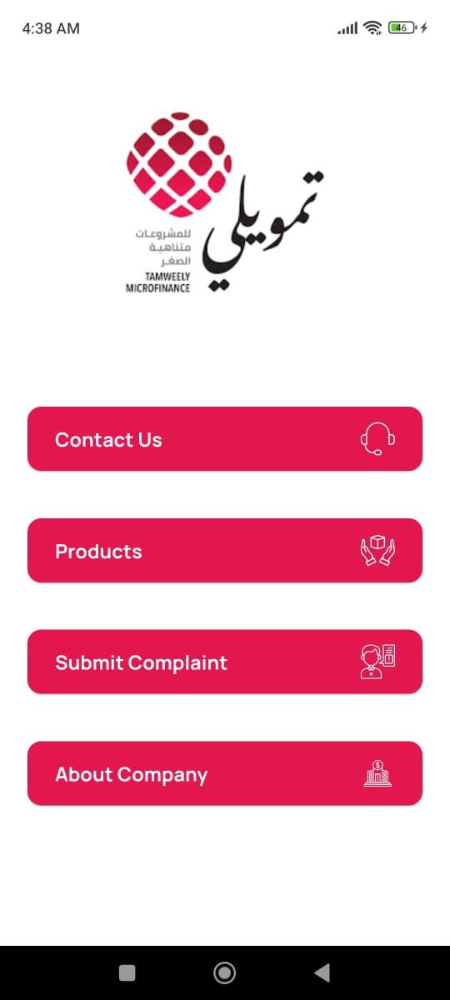

### 📞 Contact Us
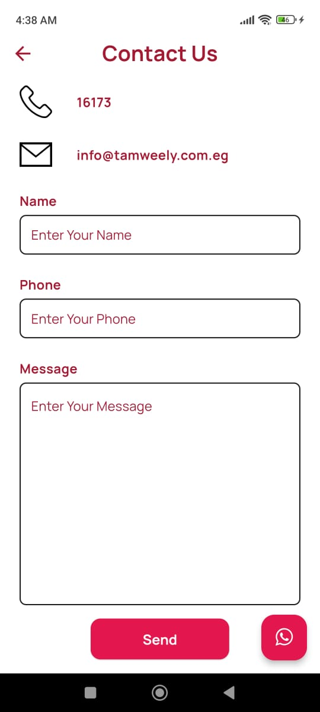

### 🏦 Products
<div>
  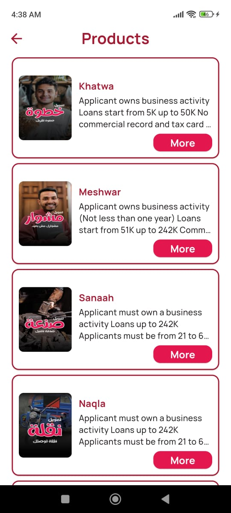
  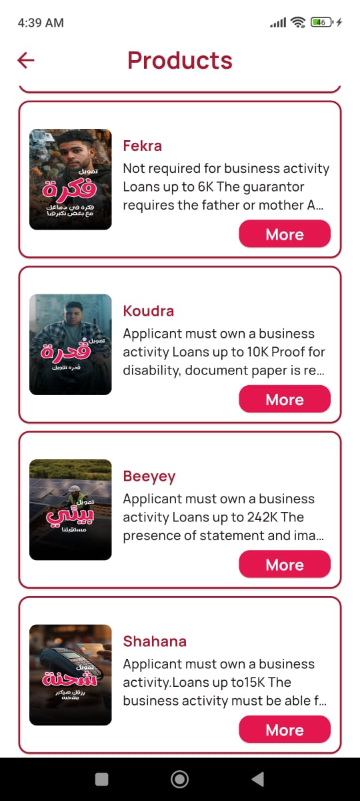
  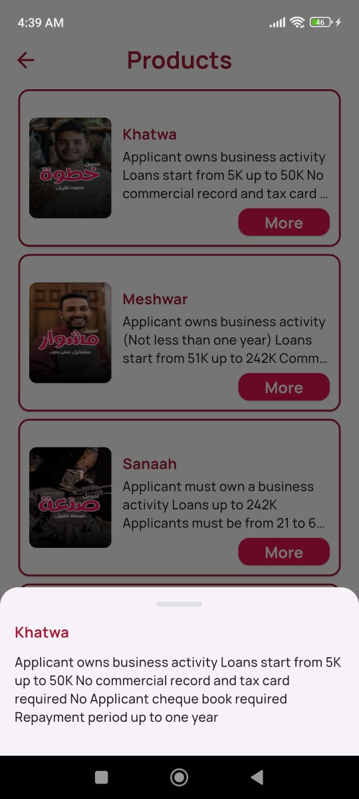
</div>

### 📝 Submit Complaint
<div>
  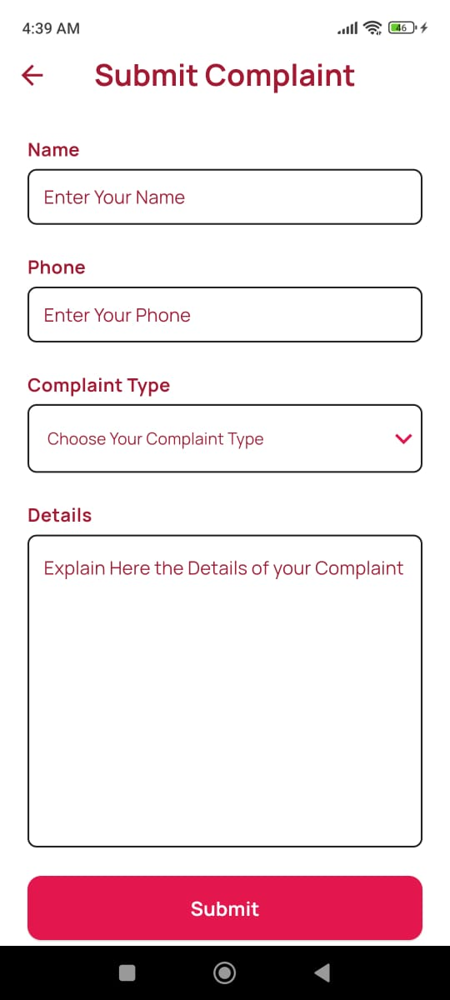
  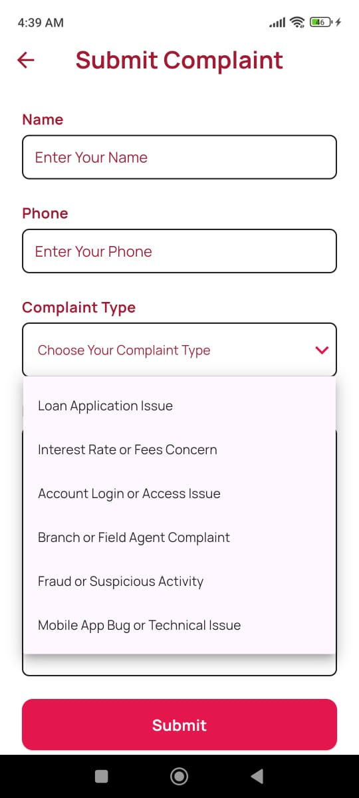
</div>

### 🏢 About Company
<div>
  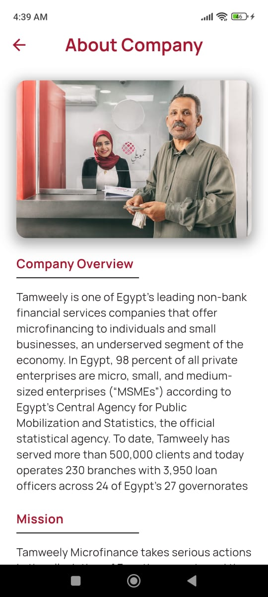
  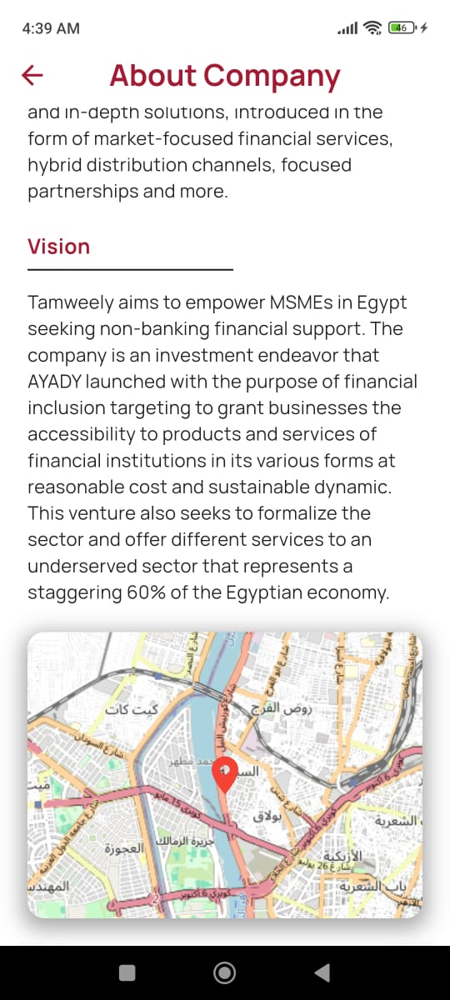
</div>

### ✅ UX Feedback & Error Handling
<div>
  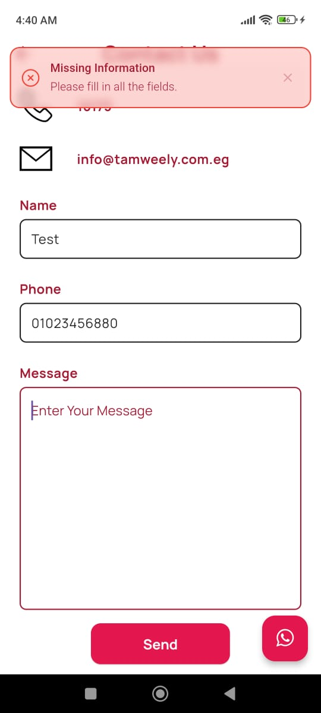
  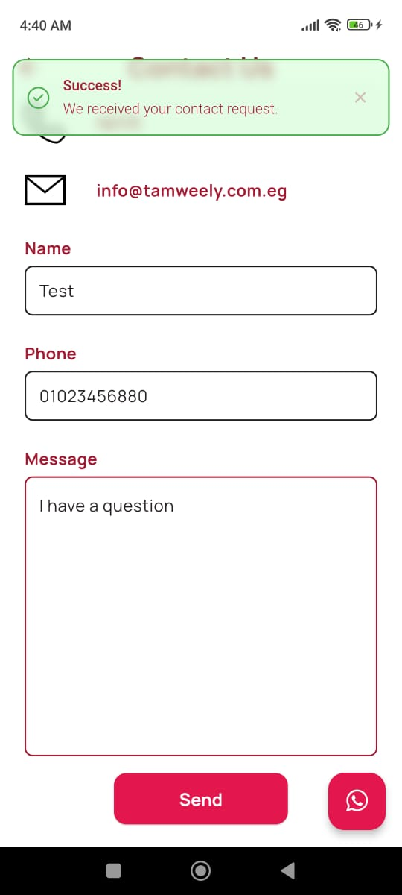
</div>

### 📡❌ No Internet Connection Handling
<div>
  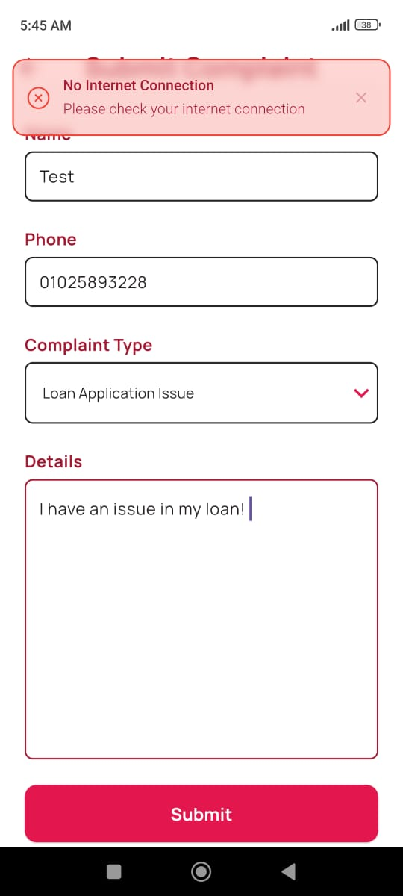
</div>

### ⏳ Loading States
<div>
  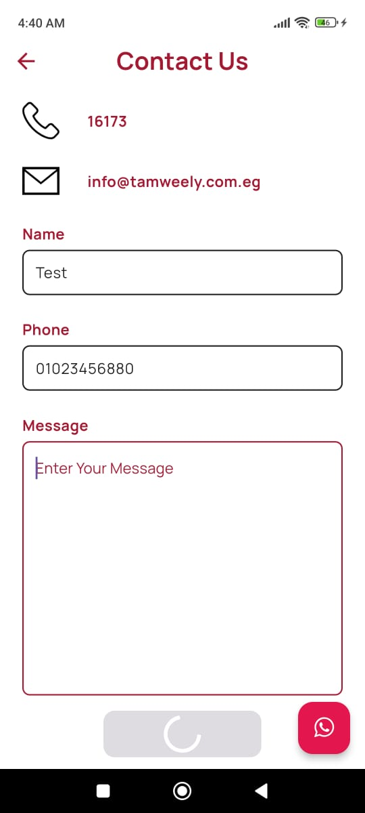
  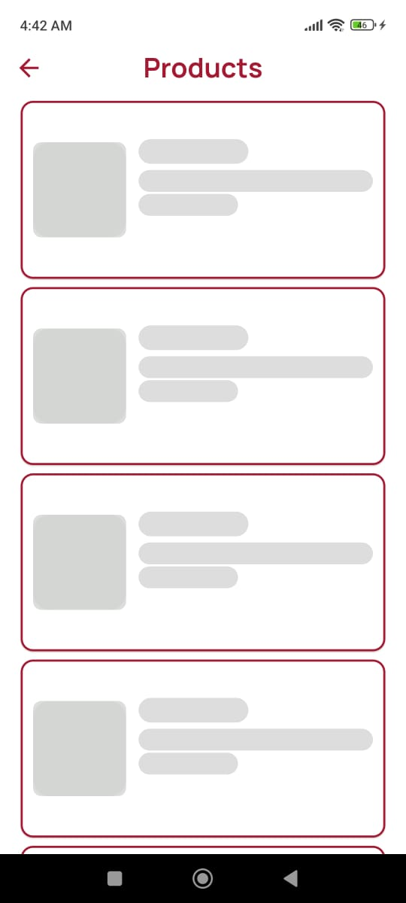
</div>


---

## 🎬 Demo Video

Watch the full demo of the Tamweely app here:  
📽️ [Tamweely Demo Video](https://drive.google.com/file/d/1KahVd99IVyNJuHXQpK6qHczy2lmhjGdb/view?usp=sharing)  

---

## 📦 APK Download

You can download and test the APK here:  
📲 [Download APK](https://drive.google.com/file/d/1i_K14WPl6WZvrDD_fXQ-JQevN1lHL6v8/view?usp=sharing)  

---

## 🧰 Getting Started

### Prerequisites

- Flutter SDK (≥ 3.x) (3.24.3)
- Dart SDK
- Android Studio / VS Code

### Installation

```bash
git clone https://github.com/your-username/tamweely-task.git
cd tamweely-task
flutter pub get
flutter run


